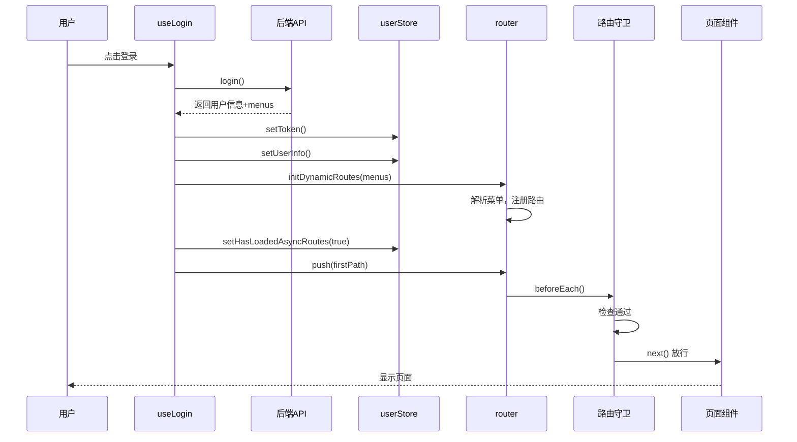
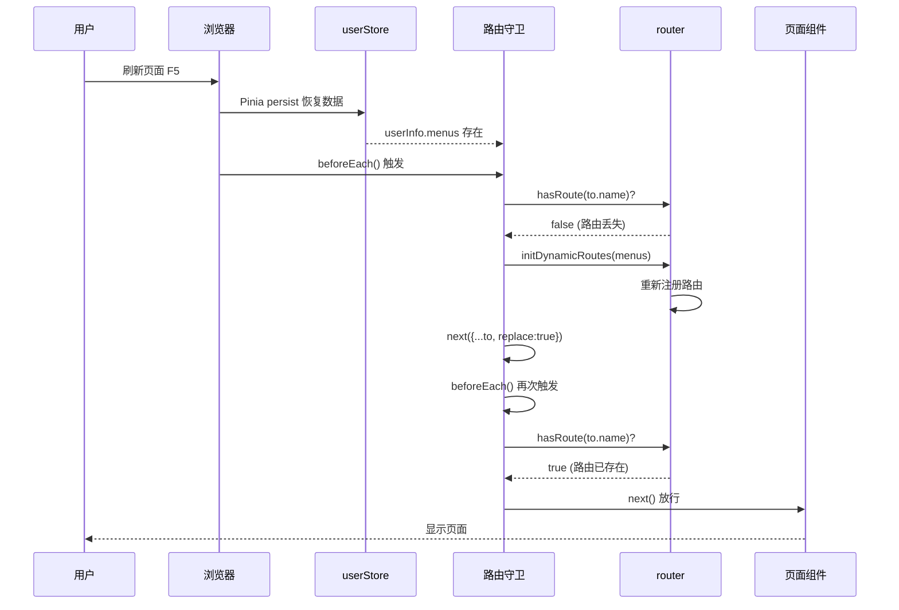

# Vue Admin 动态菜单加载流程文档

## 📋 目录

- [1. 功能概述](#1-功能概述)
- [2. 技术架构](#2-技术架构)
- [3. 核心模块](#3-核心模块)
- [4. 数据流转](#4-数据流转)
- [5. 方法调用流程](#5-方法调用流程)
- [6. 实现详解](#6-实现详解)
- [7. 使用示例](#7-使用示例)
- [8. 注意事项](#8-注意事项)
- [9. 常见问题](#9-常见问题)

---

## 1. 功能概述

### 1.1 功能介绍

动态菜单加载是一个基于用户权限的路由和菜单管理系统，核心功能包括：

- ✅ **动态路由注册**：根据后台返回的菜单数据动态生成并注册路由
- ✅ **权限控制**：不同用户看到不同的菜单和页面
- ✅ **路由持久化**：页面刷新后自动恢复动态路由
- ✅ **组件懒加载**：使用 Vite 的 glob 导入实现按需加载
- ✅ **图标动态渲染**：根据配置动态显示菜单图标
- ✅ **多级菜单支持**：递归渲染支持无限层级菜单

### 1.2 应用场景

- 多角色权限管理系统
- 企业后台管理系统
- SaaS 平台
- 需要根据用户权限动态展示功能的系统

---

## 2. 技术架构

### 2.1 技术栈

| 技术 | 版本 | 用途 |
|------|------|------|
| Vue 3 | 3.x | 框架核心 |
| Vue Router | 4.x | 路由管理 |
| Pinia | 2.x | 状态管理 |
| Element Plus | 2.x | UI 组件库 |
| Vite | 5.x | 构建工具 |

### 2.2 架构设计

```
┌─────────────────────────────────────────────────────────────┐
│                        前端应用                              │
├─────────────────────────────────────────────────────────────┤
│                                                              │
│  ┌──────────────┐      ┌──────────────┐                    │
│  │  登录组件     │─────>│  用户认证     │                    │
│  └──────────────┘      └──────────────┘                    │
│         │                      │                            │
│         ▼                      ▼                            │
│  ┌──────────────────────────────────┐                      │
│  │       获取用户信息和菜单数据       │                      │
│  └──────────────────────────────────┘                      │
│         │                                                   │
│         ▼                                                   │
│  ┌──────────────────────────────────┐                      │
│  │    Pinia Store (状态持久化)       │                      │
│  │  - userInfo (用户信息)            │                      │
│  │  - menus (菜单数据)               │                      │
│  │  - hasLoadedAsyncRoutes (标记)    │                      │
│  └──────────────────────────────────┘                      │
│         │                                                   │
│         ▼                                                   │
│  ┌──────────────────────────────────┐                      │
│  │   动态路由生成模块                 │                      │
│  │  - 解析菜单数据                    │                      │
│  │  - 生成路由配置                    │                      │
│  │  - 解析组件路径                    │                      │
│  └──────────────────────────────────┘                      │
│         │                                                   │
│         ▼                                                   │
│  ┌──────────────────────────────────┐                      │
│  │   Vue Router 动态注册              │                      │
│  │  - router.addRoute()              │                      │
│  └──────────────────────────────────┘                      │
│         │                                                   │
│         ▼                                                   │
│  ┌──────────────┐      ┌──────────────┐                    │
│  │  菜单组件     │      │  路由视图     │                    │
│  │  (递归渲染)   │      │  (懒加载)     │                    │
│  └──────────────┘      └──────────────┘                    │
│                                                              │
└─────────────────────────────────────────────────────────────┘
```

---

## 3. 核心模块

### 3.1 文件结构

```
src/
├── router/
│   ├── index.js                # 路由主文件（含路由守卫）
│   └── dynamic-routes.js       # 动态路由核心模块
├── stores/
│   └── user.js                 # 用户状态管理（Pinia）
├── composables/
│   ├── useLogin.js            # 登录逻辑
│   └── useMenus.js            # 菜单相关逻辑
├── layout/
│   ├── index.vue              # 布局组件
│   ├── Menus.vue              # 菜单容器组件
│   └── MenuItem.vue           # 菜单项组件（递归）
└── views/
    ├── login/
    │   └── index.vue          # 登录页
    ├── dashboard/
    │   └── index.vue          # 首页
    └── user/
        └── list.vue           # 用户列表
```

### 3.2 模块职责

| 模块 | 职责 |
|------|------|
| **router/index.js** | 静态路由配置、路由守卫、动态路由加载触发 |
| **router/dynamic-routes.js** | 菜单转路由、组件解析、路由注册 |
| **stores/user.js** | 用户信息存储、菜单数据持久化 |
| **layout/Menus.vue** | 菜单容器、菜单数据过滤 |
| **layout/MenuItem.vue** | 菜单项渲染、递归子菜单、图标显示 |
| **composables/useLogin.js** | 登录处理、初始化动态路由 |

---

## 4. 数据流转

### 4.1 完整流程图

```
┌─────────────┐
│   用户登录   │
└──────┬──────┘
       │
       ▼
┌─────────────────────────────┐
│  调用登录接口                 │
│  POST /api/login             │
└──────┬──────────────────────┘
       │
       ▼
┌─────────────────────────────┐
│  后端返回数据：               │
│  {                           │
│    token: "xxx",             │
│    username: "admin",        │
│    role: "1",                │
│    menus: [...]              │◄─── 关键：菜单数据
│  }                           │
└──────┬──────────────────────┘
       │
       ▼
┌─────────────────────────────┐
│  前端本地存储：               │
│  1. setToken(res.token)     │
│  2. setUserInfo(res)        │
│  3. 触发动态路由注册          │
└──────┬──────────────────────┘
       │
       ▼
┌─────────────────────────────┐
│  initDynamicRoutes()        │
│  - 解析 menus 数据           │
│  - 生成路由配置              │
│  - 注册到 router             │
└──────┬──────────────────────┘
       │
       ▼
┌─────────────────────────────┐
│  页面跳转                    │
│  router.push(firstPath)     │
└──────┬──────────────────────┘
       │
       ▼
┌─────────────────────────────┐
│  进入路由守卫                │
│  router.beforeEach()        │
└──────┬──────────────────────┘
       │
       ▼
┌─────────────────────────────┐
│  检查 token                  │
└──────┬──────────────────────┘
       │
       ├─ 无 token ──> 跳转登录页
       │
       ▼
┌─────────────────────────────┐
│  检查是否需要加载动态路由     │
│  needLoadRoutes =           │
│  !hasLoadedAsyncRoutes ||   │
│  !router.hasRoute(to.name)  │
└──────┬──────────────────────┘
       │
       ├─ 需要 ──> 重新加载动态路由
       │
       ▼
┌─────────────────────────────┐
│  渲染目标页面                │
│  - 组件懒加载                │
│  - 菜单显示                  │
└─────────────────────────────┘
```

### 4.2 刷新页面流程

```
┌─────────────┐
│  页面刷新    │
└──────┬──────┘
       │
       ▼
┌─────────────────────────────┐
│  应用初始化                  │
│  - new Router() 创建新实例   │
│  - 动态路由丢失              │
└──────┬──────────────────────┘
       │
       ▼
┌─────────────────────────────┐
│  进入路由守卫                │
│  router.beforeEach()        │
└──────┬──────────────────────┘
       │
       ▼
┌─────────────────────────────┐
│  从持久化存储恢复数据         │
│  - Pinia persist 自动恢复    │
│  - userInfo.menus 仍然存在   │
└──────┬──────────────────────┘
       │
       ▼
┌─────────────────────────────┐
│  检查路由是否存在            │
│  !router.hasRoute(to.name)  │◄─── 关键判断
└──────┬──────────────────────┘
       │
       ▼ (路由不存在)
┌─────────────────────────────┐
│  重新加载动态路由            │
│  initDynamicRoutes(menus)   │
└──────┬──────────────────────┘
       │
       ▼
┌─────────────────────────────┐
│  重新导航                    │
│  next({...to, replace:true})│
└──────┬──────────────────────┘
       │
       ▼
┌─────────────────────────────┐
│  页面恢复正常                │
└─────────────────────────────┘
```

---

## 5. 方法调用流程

本章节详细说明从用户登录到页面渲染，以及页面刷新后，各个方法的调用顺序和调用关系。

### 5.1 用户登录流程 - 方法调用顺序

#### 流程概览

```
用户点击登录按钮
    ↓
① handleLogin()           [composables/useLogin.js]
    ↓
② login()                 [api/user.js]
    ↓
③ setToken()              [utils/auth.js]
    ↓
④ setUserInfo()           [stores/user.js]
    ↓
⑤ initDynamicRoutes()     [router/dynamic-routes.js]
    ↓
⑥ buildRoutesFromMenus()  [router/dynamic-routes.js]
    ↓
⑦ mapMenuToRoute()        [router/dynamic-routes.js]
    ↓
⑧ resolveComponent()      [router/dynamic-routes.js]
    ↓
⑨ router.addRoute()       [Vue Router API]
    ↓
⑩ setHasLoadedAsyncRoutes() [stores/user.js]
    ↓
⑪ router.push()           [Vue Router API]
    ↓
⑫ router.beforeEach()     [router/index.js - 路由守卫]
    ↓
⑬ 渲染目标页面
```

#### 详细步骤说明

**步骤 ①：handleLogin() - 触发登录**

```javascript
// 文件位置：src/composables/useLogin.js
const handleLogin = async () => {
    if (loginForm.uid && loginForm.password) {
        // 👉 调用步骤 ②
        const res = await login(loginForm)
        
        if (!res) {
            ElMessage.error('登录失败，用户名或密码错误！')
            return
        }
        
        // 👉 调用步骤 ③
        setToken(res.token)
        
        // 👉 调用步骤 ④
        setUserInfo(res)
        
        // 👉 调用步骤 ⑤
        initDynamicRoutes(router, res.menus)
        
        // 👉 调用步骤 ⑩
        setHasLoadedAsyncRoutes(true)
        
        ElMessage.success('登录成功！')
        
        const firstPath = res?.menus?.[0]?.path || '/dashboard'
        // 👉 调用步骤 ⑪
        router.push(firstPath)
    }
}
```

**关键点：**
- 用户交互的入口函数
- 验证表单数据
- 协调所有后续操作

---

**步骤 ②：login() - 调用登录接口**

```javascript
// 文件位置：src/api/user.js
export const login = async (data) => {
    // 发送登录请求到后端
    const response = await request.post('/api/login', data)
    return response.data
}
```

**返回数据结构：**
```javascript
{
    token: "eyJhbGciOiJIUzI1NiIsInR5cCI6IkpXVCJ9...",
    uid: "admin",
    username: "管理员",
    email: "admin@example.com",
    role: "1",
    avatar: "https://example.com/avatar.jpg",
    menus: [  // 👈 关键数据
        {
            path: '/dashboard',
            component: 'dashboard/index',
            name: 'Dashboard',
            menu_name: '首页',
            icon: 'House'
        },
        // ... 更多菜单
    ]
}
```

---

**步骤 ③：setToken() - 存储 Token**

```javascript
// 文件位置：src/utils/auth.js
const setToken = (token) => {
    localStorage.setItem('token', token)
}
```

**作用：**
- 将 token 存储到 localStorage
- 用于后续 API 请求的身份验证

---

**步骤 ④：setUserInfo() - 存储用户信息**

```javascript
// 文件位置：src/stores/user.js
const setUserInfo = (user) => {
    userInfo.value = {
        ...getDefaultUserInfo(),
        ...user,
        menus: Array.isArray(user?.menus) ? user.menus : []
    }
    // Pinia persist 插件会自动将数据持久化到 localStorage
}
```

**作用：**
- 将用户信息（包括 menus）存储到 Pinia Store
- 自动持久化到 localStorage（persist: true）
- 供全局访问使用

---

**步骤 ⑤：initDynamicRoutes() - 初始化动态路由**

```javascript
// 文件位置：src/router/dynamic-routes.js
export const initDynamicRoutes = (router, menus = []) => {
    // 👉 调用步骤 ⑥
    const routes = buildRoutesFromMenus(menus)
    
    // 遍历生成的路由配置
    routes.forEach((route) => {
        if (!router.hasRoute(route.name)) {
            // 👉 调用步骤 ⑨
            router.addRoute('layout', route)
        }
    })
    
    return routes
}
```

**作用：**
- 将菜单数据转换为路由配置
- 动态注册路由到 Vue Router

---

**步骤 ⑥：buildRoutesFromMenus() - 批量转换菜单**

```javascript
// 文件位置：src/router/dynamic-routes.js
export const buildRoutesFromMenus = (menus = []) => {
    // 👉 对每个菜单项调用步骤 ⑦
    return menus.map((menu) => mapMenuToRoute(menu)).filter(Boolean)
}
```

**作用：**
- 遍历菜单数组
- 为每个菜单项生成路由配置
- 过滤掉无效的配置

---

**步骤 ⑦：mapMenuToRoute() - 菜单转路由**

```javascript
// 文件位置：src/router/dynamic-routes.js
const mapMenuToRoute = (menu, parentPath = '') => {
    // 验证必需字段
    if (!menu?.path || !menu?.component) {
        return null
    }
    
    // 👉 调用步骤 ⑧
    const component = resolveComponent(menu.component)
    if (!component) {
        console.warn(`[dynamic-route] 未找到组件: ${menu.component}`)
        return null
    }
    
    // 构建路径
    const fullPath = menu.path.startsWith('/') 
        ? menu.path 
        : `${parentPath}/${menu.path}`.replace(/\/+/g, '/')
    const routePath = fullPath.replace(/^\//, '')
    
    // 构建路由配置对象
    const route = {
        path: routePath,
        name: menu.name || routePath.replace(/\//g, '_'),
        component,  // 👈 从步骤 ⑧ 获得
        meta: {
            title: menu.meta?.title || menu.title || menu.name || routePath,
            icon: menu.meta?.icon || menu.icon || '',
            hidden: Boolean(menu.meta?.hidden || menu.hidden)
        }
    }
    
    // 递归处理子菜单
    if (Array.isArray(menu.children) && menu.children.length > 0) {
        route.children = menu.children
            .map((child) => mapMenuToRoute(child, fullPath))  // 👈 递归调用自己
            .filter(Boolean)
    }
    
    return route
}
```

**作用：**
- 将单个菜单对象转换为路由配置对象
- 解析组件路径
- 构建路由元信息
- 递归处理子菜单（支持多级菜单）

---

**步骤 ⑧：resolveComponent() - 解析组件**

```javascript
// 文件位置：src/router/dynamic-routes.js
const resolveComponent = (viewPath) => {
    // 规范化路径：'user/list' -> 'user/list.vue'
    const normalized = normalizeViewPath(viewPath)
    
    // 构建完整 key
    const key = `/src/views/${normalized}`
    // 例如：'/src/views/dashboard/index.vue'
    
    // 从 viewModules 对象中获取对应的动态导入函数
    const component = viewModules[key]
    // 返回: () => import('/src/views/dashboard/index.vue')
    
    return component
}
```

**作用：**
- 根据组件路径字符串获取对应的组件导入函数
- 实现组件懒加载

---

**步骤 ⑨：router.addRoute() - 注册路由**

```javascript
// Vue Router API
router.addRoute('layout', route)
```

**参数说明：**
- 第一个参数：`'layout'` - 父路由名称
- 第二个参数：`route` - 要添加的子路由配置

**作用：**
- 将动态路由注册到 Vue Router 实例
- 作为 'layout' 路由的子路由

**路由结构：**
```
/                          (layout 父路由)
├── dashboard              (动态添加)
├── user/list              (动态添加)
└── system/role            (动态添加)
```

---

**步骤 ⑩：setHasLoadedAsyncRoutes() - 设置加载标记**

```javascript
// 文件位置：src/stores/user.js
const setHasLoadedAsyncRoutes = (val) => {
    hasLoadedAsyncRoutes.value = Boolean(val)
}
```

**作用：**
- 标记动态路由已加载
- 防止重复加载
- 该值会被持久化存储

---

**步骤 ⑪：router.push() - 页面跳转**

```javascript
// Vue Router API
router.push(firstPath)
// 例如：router.push('/dashboard')
```

**作用：**
- 跳转到目标页面
- 触发路由守卫（步骤 ⑫）

---

**步骤 ⑫：router.beforeEach() - 路由守卫**

```javascript
// 文件位置：src/router/index.js
router.beforeEach((to, from, next) => {
    const token = getToken()
    
    // 登录页直接放行
    if (to.path === '/login') {
        next()
        return
    }
    
    // 未登录跳转登录页
    if (!token) {
        next('/login')
        return
    }
    
    const userStore = useUserStore()
    
    // 判断是否需要加载动态路由
    const needLoadRoutes = !userStore.hasLoadedAsyncRoutes 
                        || !router.hasRoute(to.name)
    
    if (needLoadRoutes) {
        // 这个分支在首次登录时不会进入（因为已经在步骤 ⑤ 加载过了）
        // 主要用于页面刷新时重新加载路由
    }
    
    // 👉 正常放行，渲染目标页面
    next()
})
```

**作用：**
- 权限验证
- 动态路由加载判断
- 控制页面访问

---

**步骤 ⑬：渲染目标页面**

当路由守卫放行后，Vue Router 会：
1. 根据路由配置找到对应的组件
2. 执行组件的动态导入函数（懒加载）
3. 渲染组件到 `<router-view>`
4. 同时触发菜单组件的渲染

---

### 5.2 页面刷新流程 - 方法调用顺序

#### 流程概览

```
用户刷新页面（F5 或浏览器刷新按钮）
    ↓
① 应用重新初始化
    - new Router() 创建新实例
    - 动态路由丢失
    ↓
② Pinia 自动恢复数据
    - userInfo（含 menus）
    - hasLoadedAsyncRoutes
    ↓
③ router.beforeEach()     [router/index.js - 路由守卫]
    ↓
④ getToken()              [utils/auth.js]
    ↓
⑤ useUserStore()          [stores/user.js]
    ↓
⑥ router.hasRoute(to.name) 检查
    ↓
⑦ initDynamicRoutes()     [router/dynamic-routes.js]
    ↓
⑧ buildRoutesFromMenus()  [router/dynamic-routes.js]
    ↓
⑨ mapMenuToRoute()        [router/dynamic-routes.js]
    ↓
⑩ resolveComponent()      [router/dynamic-routes.js]
    ↓
⑪ router.addRoute()       [Vue Router API]
    ↓
⑫ setHasLoadedAsyncRoutes() [stores/user.js]
    ↓
⑬ next({...to, replace: true}) 重新导航
    ↓
⑭ 再次进入 router.beforeEach()
    ↓
⑮ 检查通过，放行 next()
    ↓
⑯ 渲染目标页面
```

#### 详细步骤说明

**步骤 ①：应用重新初始化**

```javascript
// 文件位置：src/main.js
const app = createApp(App)
app.use(router)  // 👈 创建全新的 router 实例
app.use(pinia)
app.mount('#app')
```

**关键点：**
- Router 实例是全新的，之前动态添加的路由全部丢失
- 只包含静态路由（login 和 layout）

---

**步骤 ②：Pinia 自动恢复数据**

```javascript
// 文件位置：src/stores/user.js
export const useUserStore = defineStore('userStore', () => {
    // ...
}, {
    persist: true  // 👈 关键配置
})
```

**作用：**
- Pinia persist 插件自动从 localStorage 读取数据
- 恢复 `userInfo`（包括 menus）
- 恢复 `hasLoadedAsyncRoutes`（值为 true）

**注意：**
- 虽然 `hasLoadedAsyncRoutes` 为 true，但 router 实例是新的
- 所以动态路由仍然需要重新注册

---

**步骤 ③：router.beforeEach() - 路由守卫触发**

```javascript
// 文件位置：src/router/index.js
router.beforeEach((to, from, next) => {
    // 页面刷新时，用户访问的是之前的路由，如 '/dashboard'
    // to.path = '/dashboard'
    // to.name = 'dashboard'
    
    // 👉 执行步骤 ④
    const token = getToken()
    
    // ...
})
```

---

**步骤 ④：getToken() - 获取 Token**

```javascript
// 文件位置：src/utils/auth.js
const getToken = () => {
    return localStorage.getItem('token')
}
```

**作用：**
- 从 localStorage 读取 token
- 验证用户是否已登录

---

**步骤 ⑤：useUserStore() - 获取用户信息**

```javascript
const userStore = useUserStore()
// userStore.userInfo.menus 👈 包含菜单数据（已恢复）
// userStore.hasLoadedAsyncRoutes 👈 为 true（已恢复）
```

---

**步骤 ⑥：router.hasRoute(to.name) - 检查路由是否存在**

```javascript
const needLoadRoutes = !userStore.hasLoadedAsyncRoutes 
                    || !router.hasRoute(to.name)
// ↑ 第一个条件为 false（因为 hasLoadedAsyncRoutes 为 true）
// ↑ 第二个条件为 true（因为动态路由丢失，router 中没有该路由）
// ↑ 所以 needLoadRoutes = true
```

**关键判断：**
```javascript
if (needLoadRoutes) {
    const menus = userStore.userInfo?.menus || []
    
    if (menus.length > 0) {
        // 👉 执行步骤 ⑦：重新加载动态路由
        initDynamicRoutes(router, menus)
        
        // 👉 执行步骤 ⑫
        userStore.setHasLoadedAsyncRoutes(true)
        
        // 👉 执行步骤 ⑬：重新导航
        next({ ...to, replace: true })
        return
    }
}
```

**`next({ ...to, replace: true })` 的作用：**
- 重新触发导航到目标路由
- 此时动态路由已注册，可以正常访问
- `replace: true` 表示替换当前历史记录

---

**步骤 ⑦-⑫：重新加载动态路由**

这些步骤与首次登录时的步骤 ⑤-⑩ 完全相同：
- ⑦ initDynamicRoutes()
- ⑧ buildRoutesFromMenus()
- ⑨ mapMenuToRoute()
- ⑩ resolveComponent()
- ⑪ router.addRoute()
- ⑫ setHasLoadedAsyncRoutes()

---

**步骤 ⑬：next({...to, replace: true}) - 重新导航**

```javascript
next({ ...to, replace: true })
// 等价于：
next({
    path: to.path,
    query: to.query,
    params: to.params,
    replace: true
})
```

**作用：**
- 终止当前导航
- 发起一个新的导航到相同目标
- 此时路由已注册，可以正常匹配

---

**步骤 ⑭：再次进入 router.beforeEach()**

重新导航会再次触发路由守卫：

```javascript
router.beforeEach((to, from, next) => {
    const token = getToken()  // ✅ 有 token
    
    if (to.path === '/login') {  // ❌ 不是登录页
        next()
        return
    }
    
    if (!token) {  // ❌ 有 token
        next('/login')
        return
    }
    
    const userStore = useUserStore()
    
    const needLoadRoutes = !userStore.hasLoadedAsyncRoutes  // ✅ true
                        || !router.hasRoute(to.name)  // ✅ true（路由已存在）
    // needLoadRoutes = false
    
    if (needLoadRoutes) {  // ❌ 不进入
        // ...
    }
    
    // 👉 执行步骤 ⑮
    next()  // ✅ 放行
})
```

---

**步骤 ⑮：next() - 放行**

路由守卫检查通过，放行导航。

---

**步骤 ⑯：渲染目标页面**

与首次登录的步骤 ⑬ 相同，渲染目标页面和菜单。

---

### 5.3 菜单渲染流程 - 方法调用顺序

当用户信息中包含菜单数据时，菜单会自动渲染。

#### 流程概览

```
Layout 组件挂载
    ↓
① Menus.vue 组件初始化
    ↓
② useMenus()              [composables/useMenus.js]
    ↓
③ useUserStore()          [stores/user.js]
    ↓
④ storeToRefs()           [pinia]
    ↓
⑤ computed: visibleMenus  [layout/Menus.vue]
    - 过滤 hidden 菜单
    ↓
⑥ v-for 渲染 MenuItem 组件
    ↓
⑦ MenuItem.vue 初始化   [layout/MenuItem.vue]
    ↓
⑧ computed: hasChildren   检查是否有子菜单
    ↓
⑨ computed: menuTitle     获取菜单标题
    ↓
⑩ computed: menuIcon      获取菜单图标
    ↓
⑪ getMenuIcon()           [router/dynamic-routes.js]
    ↓
⑫ 渲染 el-menu-item 或 el-sub-menu
    ↓
⑬ 如果有子菜单，递归渲染 MenuItem
    - 回到步骤 ⑦
```

#### 详细步骤说明

**步骤 ①-④：获取用户信息**

```vue
<!-- 文件位置：src/layout/Menus.vue -->
<script setup>
import { useMenus } from '@/composables/useMenus'
import { computed } from 'vue'
import MenuItem from './MenuItem.vue'

// 👉 步骤 ②
const { userInfo } = useMenus()
</script>
```

```javascript
// 文件位置：src/composables/useMenus.js
export function useMenus() {
    // 👉 步骤 ③
    const userStore = useUserStore()
    
    // 👉 步骤 ④
    const { userInfo } = storeToRefs(userStore)
    // storeToRefs 保持响应式引用
    
    return {
        userInfo,
        logout
    }
}
```

---

**步骤 ⑤：computed: visibleMenus - 过滤菜单**

```vue
<!-- 文件位置：src/layout/Menus.vue -->
<script setup>
const visibleMenus = computed(() => {
    // 过滤掉 hidden 为 true 的菜单
    return userInfo.value?.menus?.filter(menu => !menu.hidden) || []
})
</script>
```

---

**步骤 ⑥：v-for 渲染 MenuItem**

```vue
<!-- 文件位置：src/layout/Menus.vue -->
<template>
    <el-menu>
        <!-- 遍历可见菜单，为每个菜单创建 MenuItem 组件 -->
        <MenuItem 
            v-for="menu in visibleMenus" 
            :key="menu.path" 
            :menu="menu" 
        />
    </el-menu>
</template>
```

---

**步骤 ⑦-⑩：MenuItem 组件初始化**

```vue
<!-- 文件位置：src/layout/MenuItem.vue -->
<script setup>
import { getMenuIcon } from '@/router/dynamic-routes'
import { computed } from 'vue'

const props = defineProps({
    menu: {
        type: Object,
        required: true
    }
})

// 👉 步骤 ⑧：判断是否有子菜单
const hasChildren = computed(() => 
    Array.isArray(props.menu.children) && props.menu.children.length > 0
)

// 👉 步骤 ⑨：获取菜单标题
const menuTitle = computed(() => 
    props.menu?.menu_name || '未命名菜单'
)

// 👉 步骤 ⑩：获取菜单图标
const menuIcon = computed(() => 
    getMenuIcon(props.menu?.meta?.icon || props.menu?.icon)  // 👉 调用步骤 ⑪
)
</script>
```

---

**步骤 ⑪：getMenuIcon() - 获取图标组件**

```javascript
// 文件位置：src/router/dynamic-routes.js
import * as ElementPlusIconsVue from '@element-plus/icons-vue'

export const getMenuIcon = (iconName) => {
    // 从 Element Plus 图标库中获取对应图标
    return ElementPlusIconsVue[iconName] || ElementPlusIconsVue.Menu
    // 例如：iconName = 'House' 返回 House 组件
    //      iconName = undefined 返回 Menu 组件（默认）
}
```

---

**步骤 ⑫-⑬：渲染菜单项**

```vue
<!-- 文件位置：src/layout/MenuItem.vue -->
<template>
    <!-- 有子菜单：渲染子菜单 -->
    <el-sub-menu v-if="hasChildren" :index="menu.path">
        <template #title>
            <el-icon>
                <component :is="menuIcon" />  <!-- 动态图标组件 -->
            </el-icon>
            <span>{{ menuTitle }}</span>
        </template>
        
        <!-- 👉 步骤 ⑬：递归渲染子菜单 -->
        <MenuItem 
            v-for="child in menu.children" 
            :key="child.path" 
            :menu="child"  <!-- 递归调用自己 -->
        />
    </el-sub-menu>

    <!-- 无子菜单：渲染菜单项 -->
    <el-menu-item v-else :index="menu.path">
        <el-icon>
            <component :is="menuIcon" />
        </el-icon>
        <span>{{ menuTitle }}</span>
    </el-menu-item>
</template>
```

**递归示例：**

```
菜单数据：
{
    menu_name: '系统管理',
    icon: 'Setting',
    children: [
        { menu_name: '用户管理', icon: 'User' },
        { menu_name: '角色管理', icon: 'Avatar' }
    ]
}

渲染过程：
1. 渲染 "系统管理" el-sub-menu（步骤 ⑦-⑫）
2. 遍历 children，递归渲染：
   - 渲染 "用户管理" el-menu-item（步骤 ⑦-⑫）
   - 渲染 "角色管理" el-menu-item（步骤 ⑦-⑫）
```

---

### 5.4 关键方法调用关系图

```
登录场景：
handleLogin
  ├─ login (API)
  ├─ setToken
  ├─ setUserInfo
  ├─ initDynamicRoutes
  │   ├─ buildRoutesFromMenus
  │   │   └─ mapMenuToRoute (递归)
  │   │       └─ resolveComponent
  │   │           └─ normalizeViewPath
  │   └─ router.addRoute
  ├─ setHasLoadedAsyncRoutes
  └─ router.push
      └─ router.beforeEach
          └─ next()

刷新场景：
router.beforeEach
  ├─ getToken
  ├─ useUserStore
  ├─ router.hasRoute
  ├─ initDynamicRoutes (如果需要)
  │   ├─ buildRoutesFromMenus
  │   │   └─ mapMenuToRoute
  │   │       └─ resolveComponent
  │   └─ router.addRoute
  ├─ setHasLoadedAsyncRoutes
  └─ next({...to, replace: true})
      └─ router.beforeEach (再次)
          └─ next()

菜单渲染：
Menus.vue
  ├─ useMenus
  │   └─ useUserStore
  │       └─ storeToRefs
  └─ computed: visibleMenus
      └─ MenuItem.vue (递归)
          ├─ computed: hasChildren
          ├─ computed: menuTitle
          └─ computed: menuIcon
              └─ getMenuIcon
```

---

### 5.5 时序图总结

#### 登录时序



#### 刷新时序



---

## 6. 实现详解

### 5.1 动态路由生成模块 (dynamic-routes.js)

#### 5.1.1 组件自动导入

```javascript
/**
 * 使用 Vite 的 glob 导入功能
 * 批量导入 views 目录下的所有 .vue 组件
 */
const viewModules = import.meta.glob('@/views/**/*.vue')

// viewModules 结构示例：
// {
//   '/src/views/dashboard/index.vue': () => import('/src/views/dashboard/index.vue'),
//   '/src/views/user/list.vue': () => import('/src/views/user/list.vue'),
//   ...
// }
```

**关键点：**
- 使用 Vite 的 `import.meta.glob` API
- 返回对象，key 是文件路径，value 是动态导入函数
- 实现组件的懒加载（按需加载）

#### 5.1.2 路径规范化

```javascript
/**
 * 规范化视图路径
 * @example
 * normalizeViewPath('user/list')      => 'user/list.vue'
 * normalizeViewPath('/user/list')     => 'user/list.vue'
 * normalizeViewPath('user/list.vue')  => 'user/list.vue'
 */
const normalizeViewPath = (viewPath = '') => {
    const trimmed = viewPath.replace(/^\/+/, '')  // 去除开头斜杠
    return trimmed.endsWith('.vue') ? trimmed : `${trimmed}.vue`
}
```

#### 5.1.3 组件解析

```javascript
/**
 * 解析组件路径，返回动态导入函数
 */
const resolveComponent = (viewPath) => {
    const normalized = normalizeViewPath(viewPath)
    const key = `/src/views/${normalized}`  // 构建完整路径
    
    const component = viewModules[key]
    
    if (!component) {
        console.warn(`[dynamic-route] 未找到组件: ${viewPath}`)
    }
    
    return component
}
```

**路径映射示例：**

| 后台返回 | 规范化后 | 最终 key |
|---------|---------|----------|
| `dashboard/index` | `dashboard/index.vue` | `/src/views/dashboard/index.vue` |
| `user/list` | `user/list.vue` | `/src/views/user/list.vue` |
| `/user/list.vue` | `user/list.vue` | `/src/views/user/list.vue` |

#### 5.1.4 菜单转路由

```javascript
/**
 * 将单个菜单项转换为路由配置对象
 */
const mapMenuToRoute = (menu, parentPath = '') => {
    // 1. 验证必需字段
    if (!menu?.path || !menu?.component) {
        return null
    }

    // 2. 解析组件
    const component = resolveComponent(menu.component)
    if (!component) {
        console.warn(`[dynamic-route] 未找到组件: ${menu.component}`)
        return null
    }

    // 3. 构建完整路径
    const fullPath = menu.path.startsWith('/') 
        ? menu.path 
        : `${parentPath}/${menu.path}`.replace(/\/+/g, '/')
    
    // 4. 去除开头斜杠（子路由不需要斜杠）
    const routePath = fullPath.replace(/^\//, '')

    // 5. 构建路由对象
    const route = {
        path: routePath,
        name: menu.name || routePath.replace(/\//g, '_'),
        component,
        meta: {
            title: menu.meta?.title || menu.title || menu.name || routePath,
            icon: menu.meta?.icon || menu.icon || '',
            hidden: Boolean(menu.meta?.hidden || menu.hidden)
        }
    }

    // 6. 递归处理子菜单
    if (Array.isArray(menu.children) && menu.children.length > 0) {
        route.children = menu.children
            .map((child) => mapMenuToRoute(child, fullPath))
            .filter(Boolean)
    }

    return route
}
```

**转换示例：**

输入（后台菜单数据）：
```javascript
{
    path: '/dashboard',
    component: 'dashboard/index',
    name: 'Dashboard',
    title: '首页',
    icon: 'House'
}
```

输出（路由配置）：
```javascript
{
    path: 'dashboard',  // 去除开头斜杠，作为 layout 的子路由
    name: 'Dashboard',
    component: () => import('/src/views/dashboard/index.vue'),
    meta: {
        title: '首页',
        icon: 'House',
        hidden: false
    }
}
```

#### 5.1.5 动态路由注册

```javascript
/**
 * 初始化动态路由
 */
export const initDynamicRoutes = (router, menus = []) => {
    // 1. 批量转换菜单为路由配置
    const routes = buildRoutesFromMenus(menus)

    // 2. 逐个注册路由
    routes.forEach((route) => {
        if (!router.hasRoute(route.name)) {
            // 作为 'layout' 的子路由添加
            router.addRoute('layout', route)
        }
    })

    return routes
}
```

**路由层级结构：**

```
/                              (layout 父路由)
├── dashboard                  (动态添加的子路由)
├── user/list                  (动态添加的子路由)
└── settings/profile           (动态添加的子路由)
```

### 5.2 路由守卫 (router/index.js)

```javascript
router.beforeEach((to, from, next) => {
    const token = getToken()

    // 1. 登录页直接放行
    if (to.path === '/login') {
        next()
        return
    }

    // 2. 未登录跳转登录页
    if (!token) {
        next('/login')
        return
    }

    const userStore = useUserStore()

    // 3. 判断是否需要加载动态路由
    // 关键：刷新页面后 hasLoadedAsyncRoutes 为 true，但路由实例是新的
    // 所以需要检查目标路由是否真实存在
    const needLoadRoutes = !userStore.hasLoadedAsyncRoutes 
                        || !router.hasRoute(to.name)

    if (needLoadRoutes) {
        const menus = userStore.userInfo?.menus || []
        
        if (menus.length > 0) {
            // 重新加载动态路由
            initDynamicRoutes(router, menus)
            userStore.setHasLoadedAsyncRoutes(true)
            
            // 重新导航，确保动态路由生效
            next({ ...to, replace: true })
            return
        } else {
            // 没有菜单数据，跳转登录页
            next('/login')
            return
        }
    }

    // 4. 正常放行
    next()
})
```

**守卫逻辑流程图：**

```
开始
  │
  ▼
是否去登录页？
  ├─ 是 ──> 放行
  │
  ▼
有 token？
  ├─ 否 ──> 跳转登录页
  │
  ▼
需要加载路由？
(!hasLoadedAsyncRoutes || !router.hasRoute(to.name))
  ├─ 否 ──> 放行
  │
  ▼
有菜单数据？
  ├─ 否 ──> 跳转登录页
  │
  ▼
加载动态路由
  │
  ▼
重新导航
next({...to, replace: true})
```

### 5.3 状态管理 (stores/user.js)

```javascript
export const useUserStore = defineStore('userStore', () => {
    // 状态
    const userInfo = ref(getDefaultUserInfo())
    const hasLoadedAsyncRoutes = ref(false)

    // 设置用户信息
    const setUserInfo = (user) => {
        userInfo.value = {
            ...getDefaultUserInfo(),
            ...user,
            menus: Array.isArray(user?.menus) ? user.menus : []
        }
    }

    // 移除用户信息
    const removeUserInfo = () => {
        userInfo.value = getDefaultUserInfo()
        hasLoadedAsyncRoutes.value = false
    }

    // 重置路由加载状态
    const resetRouteLoadStatus = () => {
        hasLoadedAsyncRoutes.value = false
    }

    // 设置路由加载标记
    const setHasLoadedAsyncRoutes = (val) => {
        hasLoadedAsyncRoutes.value = Boolean(val)
    }

    return {
        userInfo,
        hasLoadedAsyncRoutes,
        setUserInfo,
        removeUserInfo,
        resetRouteLoadStatus,
        setHasLoadedAsyncRoutes
    }
}, {
    // 开启持久化，防止刷新后数据丢失
    persist: true
})
```

**状态说明：**

| 状态 | 类型 | 说明 | 持久化 |
|------|------|------|--------|
| `userInfo` | Object | 用户信息（含菜单数据） | ✅ |
| `hasLoadedAsyncRoutes` | Boolean | 路由是否已加载标记 | ✅ |

### 5.4 菜单渲染 (layout/MenuItem.vue)

```vue
<template>
    <!-- 有子菜单：渲染子菜单 -->
    <el-sub-menu v-if="hasChildren" :index="menu.path">
        <template #title>
            <el-icon>
                <component :is="menuIcon" />
            </el-icon>
            <span>{{ menuTitle }}</span>
        </template>
        
        <!-- 递归渲染子菜单 -->
        <MenuItem 
            v-for="child in menu.children" 
            :key="child.path" 
            :menu="child" 
        />
    </el-sub-menu>

    <!-- 无子菜单：渲染菜单项 -->
    <el-menu-item v-else :index="menu.path">
        <el-icon>
            <component :is="menuIcon" />
        </el-icon>
        <span>{{ menuTitle }}</span>
    </el-menu-item>
</template>

<script setup>
import { getMenuIcon } from '@/router/dynamic-routes'
import { computed } from 'vue'

const props = defineProps({
    menu: {
        type: Object,
        required: true
    }
})

// 判断是否有子菜单
const hasChildren = computed(() => 
    Array.isArray(props.menu.children) && props.menu.children.length > 0
)

// 菜单标题
const menuTitle = computed(() => 
    props.menu?.menu_name || '未命名菜单'
)

// 菜单图标
const menuIcon = computed(() => 
    getMenuIcon(props.menu?.meta?.icon || props.menu?.icon)
)
</script>
```

**递归渲染示例：**

```
菜单数据：
{
    path: '/system',
    menu_name: '系统管理',
    icon: 'Setting',
    children: [
        { path: '/system/user', menu_name: '用户管理', icon: 'User' },
        { path: '/system/role', menu_name: '角色管理', icon: 'Avatar' }
    ]
}

渲染结果：
├─ 系统管理 (子菜单)
   ├─ 用户管理
   └─ 角色管理
```

### 5.5 图标动态加载

```javascript
import * as ElementPlusIconsVue from '@element-plus/icons-vue'

/**
 * 根据图标名称获取图标组件
 * @param {string} iconName - 图标名称，如 'User'、'House'
 * @returns {Component} - Element Plus 图标组件
 */
export const getMenuIcon = (iconName) => {
    return ElementPlusIconsVue[iconName] || ElementPlusIconsVue.Menu
}
```

**图标映射示例：**

| 后台返回 | 组件 | 显示效果 |
|---------|------|---------|
| `'User'` | `<User />` | 👤 用户图标 |
| `'House'` | `<House />` | 🏠 房子图标 |
| `'Setting'` | `<Setting />` | ⚙️ 设置图标 |
| `undefined` 或不存在 | `<Menu />` | 📋 默认图标 |

---

## 6. 使用示例

### 6.1 后台菜单数据格式

```javascript
// 登录接口返回的数据结构
{
    "token": "eyJhbGciOiJIUzI1NiIsInR5cCI6IkpXVCJ9...",
    "uid": "admin",
    "username": "管理员",
    "email": "admin@example.com",
    "role": "1",
    "avatar": "https://example.com/avatar.jpg",
    "menus": [
        {
            "id": 1,
            "path": "/dashboard",
            "component": "dashboard/index",
            "name": "Dashboard",
            "menu_name": "首页",
            "icon": "House",
            "hidden": false,
            "meta": {
                "title": "首页",
                "icon": "House"
            }
        },
        {
            "id": 2,
            "path": "/user",
            "component": "user/list",
            "name": "UserList",
            "menu_name": "用户管理",
            "icon": "User",
            "hidden": false,
            "meta": {
                "title": "用户管理",
                "icon": "User"
            }
        },
        {
            "id": 3,
            "path": "/system",
            "component": "system/index",
            "name": "System",
            "menu_name": "系统管理",
            "icon": "Setting",
            "hidden": false,
            "children": [
                {
                    "id": 31,
                    "path": "/system/role",
                    "component": "system/role",
                    "name": "Role",
                    "menu_name": "角色管理",
                    "icon": "Avatar"
                },
                {
                    "id": 32,
                    "path": "/system/menu",
                    "component": "system/menu",
                    "name": "Menu",
                    "menu_name": "菜单管理",
                    "icon": "Menu"
                }
            ]
        }
    ]
}
```

### 6.2 菜单数据字段说明

| 字段 | 类型 | 必需 | 说明 |
|------|------|------|------|
| `id` | Number | 否 | 菜单唯一标识 |
| `path` | String | **是** | 路由路径（如 `/dashboard`） |
| `component` | String | **是** | 组件路径（如 `dashboard/index`） |
| `name` | String | 否 | 路由名称（默认使用 path） |
| `menu_name` | String | 否 | 菜单显示名称 |
| `icon` | String | 否 | 图标名称（Element Plus Icons） |
| `hidden` | Boolean | 否 | 是否隐藏菜单（默认 false） |
| `meta` | Object | 否 | 路由元信息 |
| `meta.title` | String | 否 | 页面标题 |
| `meta.icon` | String | 否 | 图标（优先级高于 icon） |
| `children` | Array | 否 | 子菜单数组 |

### 6.3 数据库设计参考

```sql
-- 菜单表
CREATE TABLE `sys_menu` (
  `id` int(11) NOT NULL AUTO_INCREMENT COMMENT '菜单ID',
  `parent_id` int(11) DEFAULT 0 COMMENT '父菜单ID（0表示顶级菜单）',
  `menu_name` varchar(50) NOT NULL COMMENT '菜单名称',
  `path` varchar(200) DEFAULT NULL COMMENT '路由地址',
  `component` varchar(255) DEFAULT NULL COMMENT '组件路径',
  `icon` varchar(100) DEFAULT NULL COMMENT '菜单图标',
  `sort` int(4) DEFAULT 0 COMMENT '显示顺序',
  `hidden` tinyint(1) DEFAULT 0 COMMENT '是否隐藏（0显示 1隐藏）',
  `status` tinyint(1) DEFAULT 1 COMMENT '菜单状态（0停用 1正常）',
  `create_time` datetime DEFAULT CURRENT_TIMESTAMP COMMENT '创建时间',
  `update_time` datetime DEFAULT CURRENT_TIMESTAMP ON UPDATE CURRENT_TIMESTAMP COMMENT '更新时间',
  PRIMARY KEY (`id`)
) ENGINE=InnoDB DEFAULT CHARSET=utf8mb4 COMMENT='菜单权限表';

-- 角色菜单关联表
CREATE TABLE `sys_role_menu` (
  `role_id` int(11) NOT NULL COMMENT '角色ID',
  `menu_id` int(11) NOT NULL COMMENT '菜单ID',
  PRIMARY KEY (`role_id`, `menu_id`)
) ENGINE=InnoDB DEFAULT CHARSET=utf8mb4 COMMENT='角色和菜单关联表';
```

### 6.4 示例数据

```sql
-- 插入菜单数据
INSERT INTO `sys_menu` VALUES 
(1, 0, '首页', '/dashboard', 'dashboard/index', 'House', 1, 0, 1, NOW(), NOW()),
(2, 0, '用户管理', '/user', 'user/list', 'User', 2, 0, 1, NOW(), NOW()),
(3, 0, '系统管理', '/system', 'system/index', 'Setting', 3, 0, 1, NOW(), NOW()),
(31, 3, '角色管理', '/system/role', 'system/role', 'Avatar', 1, 0, 1, NOW(), NOW()),
(32, 3, '菜单管理', '/system/menu', 'system/menu', 'Menu', 2, 0, 1, NOW(), NOW());

-- 为管理员角色分配所有菜单
INSERT INTO `sys_role_menu` VALUES (1, 1), (1, 2), (1, 3), (1, 31), (1, 32);

-- 为普通用户角色分配部分菜单
INSERT INTO `sys_role_menu` VALUES (2, 1), (2, 2);
```

---

## 7. 注意事项

### 7.1 路径配置要点

#### ✅ 正确的路径配置

| 场景 | 配置 | 说明 |
|------|------|------|
| 顶级路由 | `path: '/dashboard'` | 作为 layout 子路由，会变成 `/dashboard` |
| 组件路径 | `component: 'dashboard/index'` | 对应 `@/views/dashboard/index.vue` |
| 子路由 | `path: 'role'`（父路径 `/system`） | 完整路径为 `/system/role` |

#### ❌ 错误的配置

```javascript
// ❌ 错误：子路由路径以 / 开头
{
    path: '/system',
    children: [
        { path: '/role' }  // 错误！应该是 'role'
    ]
}

// ❌ 错误：组件路径包含 @ 或 views
{
    component: '@/views/dashboard/index.vue'  // 错误！应该是 'dashboard/index'
}

// ❌ 错误：组件路径以 / 开头
{
    component: '/dashboard/index'  // 错误！应该是 'dashboard/index'
}
```

### 7.2 路由守卫原理

**为什么刷新页面需要重新加载路由？**

```javascript
// 页面刷新前：
router 实例包含动态路由
├── / (layout)
    ├── dashboard  ✅ 存在
    └── user/list  ✅ 存在

// 页面刷新后：
new Router() 创建全新实例
├── / (layout)
    ├── dashboard  ❌ 丢失
    └── user/list  ❌ 丢失

// 解决方案：
1. Pinia persist 持久化保存 menus 数据
2. 路由守卫检测路由不存在：!router.hasRoute(to.name)
3. 从 menus 重新生成并注册路由
```

### 7.3 组件懒加载

```javascript
// Vite glob 导入 = 自动懒加载
const viewModules = import.meta.glob('@/views/**/*.vue')

// 等价于：
{
    '/src/views/dashboard/index.vue': () => import('/src/views/dashboard/index.vue')
}

// 页面访问时才会加载对应组件，提高首屏加载速度
```

### 7.4 图标库扩展

```javascript
// 导入所有 Element Plus 图标
import * as ElementPlusIconsVue from '@element-plus/icons-vue'

// 可用图标列表：
// House, User, Setting, Avatar, Menu, Document, 
// Edit, Delete, Plus, Search, Refresh, View, etc.

// 查看完整图标：https://element-plus.org/zh-CN/component/icon.html
```

### 7.5 多级菜单渲染

```javascript
// MenuItem.vue 组件递归渲染
// 支持无限层级菜单

菜单数据：
{
    menu_name: '一级菜单',
    children: [
        {
            menu_name: '二级菜单',
            children: [
                { menu_name: '三级菜单' },
                { menu_name: '三级菜单' }
            ]
        }
    ]
}

渲染结果：
├─ 一级菜单
   ├─ 二级菜单
      ├─ 三级菜单
      └─ 三级菜单
```

---

## 8. 常见问题

### Q1: 刷新页面后出现 404

**原因：** 动态路由丢失

**解决：**
1. 确保 Pinia 开启了 persist 持久化
2. 检查路由守卫中的 `!router.hasRoute(to.name)` 判断
3. 确认 `userInfo.menus` 数据存在

```javascript
// stores/user.js
export const useUserStore = defineStore('userStore', () => {
    // ...
}, {
    persist: true  // ✅ 必须开启
})
```

### Q2: 组件找不到（404）

**错误信息：**
```
[dynamic-route] 未找到组件: dashboard/index
```

**排查步骤：**

1. **检查文件是否存在**
```bash
src/views/dashboard/index.vue  # 文件必须存在
```

2. **检查路径格式**
```javascript
// ✅ 正确
component: 'dashboard/index'

// ❌ 错误
component: '@/views/dashboard/index.vue'
component: '/dashboard/index'
```

3. **查看控制台输出**
```javascript
console.log('[dynamic-route] 可用的组件路径:', Object.keys(viewModules))
// 查看实际可用的组件路径
```

### Q3: 菜单不显示

**排查步骤：**

1. **检查菜单数据是否存在**
```javascript
console.log(userInfo.value?.menus)  // 查看菜单数据
```

2. **检查 hidden 字段**
```javascript
// Menus.vue
const visibleMenus = computed(() => {
    return userInfo.value?.menus?.filter(menu => !menu.hidden) || []
})
```

3. **检查组件导入**
```vue
<!-- Menus.vue -->
<script setup>
import MenuItem from './MenuItem.vue'  // ✅ 必须导入
</script>
```

### Q4: 图标不显示

**原因：** 图标名称不正确或未导入

**解决：**

1. **检查图标名称**
```javascript
// 后台返回的图标名称必须与 Element Plus 图标名称一致
icon: 'User'     // ✅ 正确
icon: 'user'     // ❌ 错误（大小写敏感）
icon: 'el-icon-user'  // ❌ 错误（不需要前缀）
```

2. **查看可用图标**
```javascript
import * as ElementPlusIconsVue from '@element-plus/icons-vue'
console.log(Object.keys(ElementPlusIconsVue))  // 查看所有图标
```

3. **使用默认图标**
```javascript
export const getMenuIcon = (iconName) => {
    return ElementPlusIconsVue[iconName] || ElementPlusIconsVue.Menu
    // 如果图标不存在，返回默认的 Menu 图标
}
```

### Q5: 登录后跳转错误

**原因：** 菜单数据格式不正确或为空

**解决：**

```javascript
// useLogin.js
const handleLogin = async () => {
    const res = await login(loginForm)
    
    // 检查菜单数据
    if (!res.menus || res.menus.length === 0) {
        ElMessage.error('用户无权限访问任何菜单')
        return
    }
    
    initDynamicRoutes(router, res.menus)
    
    // 跳转到第一个菜单
    const firstPath = res.menus[0]?.path || '/dashboard'
    router.push(firstPath)
}
```

### Q6: 子路由路径错误

**错误示例：**
```javascript
// ❌ 错误配置
{
    path: '/system',
    children: [
        { path: '/role' }  // 子路径不应以 / 开头
    ]
}
// 结果：路由路径变成 /role（错误！）

// ✅ 正确配置
{
    path: '/system',
    children: [
        { path: 'role' }  // 子路径不要斜杠
    ]
}
// 结果：路由路径变成 /system/role（正确！）
```

### Q7: 路由重复注册警告

**警告信息：**
```
[Vue Router warn]: Route with name 'Dashboard' already exists
```

**解决：**
```javascript
// initDynamicRoutes 中已处理
routes.forEach((route) => {
    if (!router.hasRoute(route.name)) {  // ✅ 检查是否已存在
        router.addRoute('layout', route)
    }
})
```

---

## 9. 调试技巧

### 9.1 开启调试日志

```javascript
// dynamic-routes.js 中已包含调试信息

// 1. 查看可用组件
console.log('[dynamic-route] 可用的组件路径:', Object.keys(viewModules))

// 2. 查看组件加载过程
console.log(`[dynamic-route] 尝试加载组件: ${viewPath} -> ${key}`)

// 3. 查看警告信息
console.warn(`[dynamic-route] 未找到组件: ${menu.component}`)
```

### 9.2 Vue DevTools

安装 Vue DevTools 浏览器插件，可以查看：

- Pinia 中的 userInfo 和 menus 数据
- 当前注册的所有路由
- 组件层级结构

### 9.3 打印路由信息

```javascript
// 在路由守卫中添加调试信息
router.beforeEach((to, from, next) => {
    console.log('导航到:', to.path)
    console.log('路由名称:', to.name)
    console.log('路由是否存在:', router.hasRoute(to.name))
    console.log('所有路由:', router.getRoutes())
    // ...
})
```

---

## 10. 总结

### 10.1 核心流程

```
登录 → 获取菜单数据 → 存储到 Pinia → 生成路由配置 → 注册路由 → 渲染菜单
               ↓
          持久化存储
               ↓
   刷新页面后自动恢复 → 重新注册路由 → 正常访问
```

### 10.2 关键技术点

1. **Vit glob 导入** - 实现组件自动懒加载
2. **router.addRoute()** - 动态注册路由
3. **Pinia persist** - 数据持久化
4. **路由守卫** - 控制路由加载时机
5. **递归组件** - 支持多级菜单

### 10.3 优势

- ✅ **权限控制灵活**：后台控制菜单和路由
- ✅ **性能优化**：组件按需加载
- ✅ **用户体验好**：刷新页面不丢失状态
- ✅ **可扩展性强**：支持多级菜单和复杂权限

### 10.4 适用场景

- 企业后台管理系统
- 多角色权限管理平台
- SaaS 服务平台
- 需要动态配置功能的系统

---

## 📞 技术支持

如有问题，请查看：
1. 本文档的"常见问题"章节
2. 控制台的调试信息
3. Vue Router 官方文档：https://router.vuejs.org/
4. Element Plus 官方文档：https://element-plus.org/

---

**文档版本：** v1.0.0  
**最后更新：** 2026-02-22  
**作者：** Vue Admin Team
