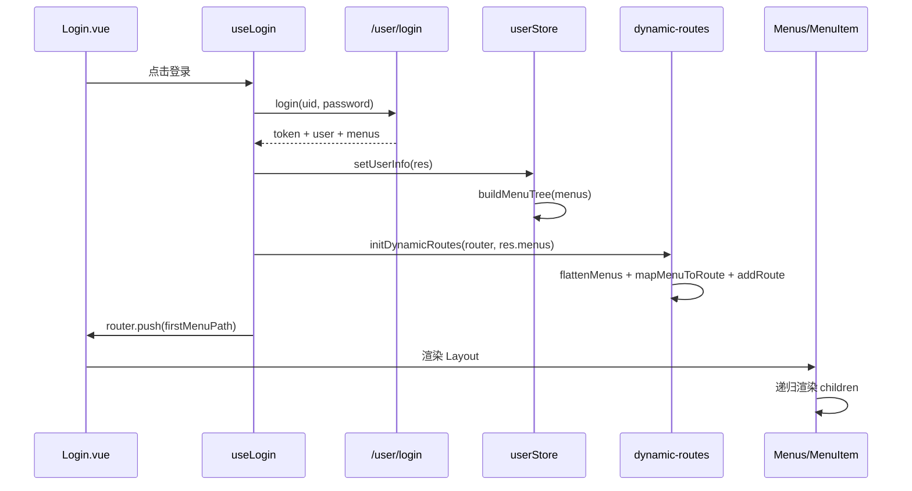

# 菜单层级显示功能实现全流程分析（前后端 + 数据 + 代码）

> 目标：基于当前项目实现，完整解释“菜单层级显示”是如何从数据库数据一路流转到前端左侧菜单渲染，以及动态路由如何与菜单联动。

---

## 1. 功能目标与核心结论

菜单层级显示并不是单一组件能力，而是一个由 **后端数据组织 + 前端状态建模 + 路由动态注册 + 递归组件渲染** 共同完成的链路。

当前项目的核心实现思想：

1. 后端返回用户可见菜单（通常按角色过滤）。
2. 前端登录后把菜单写入 Pinia。
3. 前端用 `buildMenuTree` 把扁平/混合菜单标准化为树。
4. 左侧菜单组件递归渲染树结构（`MenuItem` 自调用）。
5. 同一份菜单数据再被拍平，映射为动态路由并 `addRoute` 注册。
6. 页面刷新时通过持久化恢复菜单并重新注册动态路由，保证“刷新不丢路由”。

---

## 2. 后端数据模型：菜单层级的来源

根据 `doc/db.sql`，菜单层级关系由 `sys_menu.parent_id` 表达：

```sql
CREATE TABLE `sys_menu` (
  `id` bigint NOT NULL AUTO_INCREMENT,
  `parent_id` bigint NOT NULL DEFAULT '0',
  `menu_name` varchar(50) NOT NULL,
  `path` varchar(128) NOT NULL,
  `component` varchar(128) DEFAULT NULL,
  `icon` varchar(50) DEFAULT NULL,
  `sort_no` int NOT NULL DEFAULT '0',
  `visible` tinyint NOT NULL DEFAULT '1',
  PRIMARY KEY (`id`)
)
```

### 字段语义（与前端菜单直接相关）

- `id`：菜单唯一标识。
- `parent_id`：父菜单 ID，`0` 通常表示顶级菜单。
- `menu_name`：显示名称（前端菜单标题用它）。
- `path`：路由 path。
- `component`：前端页面组件路径（如 `system/user/index`）。
- `icon`：图标名（对应 Element Plus 图标组件）。
- `sort_no`：同级排序。
- `visible`：是否可见（当前前端最终使用 `hidden` 语义进行过滤，常见做法是后端转换 `visible` 到 `hidden`）。

### 权限关系（角色与菜单）

- `sys_role` 定义角色。
- `sys_role_menu` 做角色与菜单关联。
- 登录后后端可基于用户角色返回“该用户有权限的 menus”。

这决定了：**同一前端代码，不同用户会看到不同菜单层级和路由集合**。

---

## 3. 登录到菜单渲染的端到端主流程

下面是当前实现中的关键链路：

1. 登录页调用 `/user/login`。
2. 返回用户信息 + 菜单数据 `menus`。
3. `userStore.setUserInfo` 保存用户数据，并对 `menus` 做树化。
4. 登录成功后调用 `initDynamicRoutes(router, res.menus)` 动态注入路由。
5. 跳转到第一个可用菜单路径。
6. Layout 中的 `Menus.vue` 从 `userInfo.menus` 读取树并渲染。
7. `MenuItem.vue` 通过递归展示多级菜单。

---

## 4. 前端分层职责（按模块）

## 4.1 API 层（请求后端）

文件：`src/api/user.js`

- `login(data)` 请求 `/user/login`。
- Axios 基础实例在 `src/utils/request.js`，统一加 token、统一错误处理。

作用：**拿到包含 menus 的登录响应**。

---

## 4.2 Store 层（菜单数据标准化 + 持久化）

文件：`src/stores/user.js`

`setUserInfo(user)` 做了关键动作：

- 把用户基础信息写入 `userInfo`。
- 对 `user.menus` 调用 `buildMenuTree(user?.menus)`。

这一步非常重要：

- 即便后端返回扁平数组，前端也可还原为树。
- 即便后端返回树，`buildMenuTree` 会先拍平再重组，得到统一结构。

### 刷新不丢菜单的基础

`persist: true` 开启了 Pinia 持久化，`userInfo.menus` 会保存在本地。
刷新后可直接恢复菜单，再恢复动态路由。

---

## 4.3 菜单数据处理工具

文件：`src/utils/menu.js`

### A. `buildMenuTree(menus)`

实现步骤（按代码逻辑）：

1. 校验输入必须是数组。
2. `collectMenus` 递归采集所有节点到 `flatMenus`。
3. 用 `Map(id -> menu)` 重新构建节点，并初始化 `children: []`。
4. 二次遍历：
   - `parent_id > 0` 且能找到父节点 => push 到父节点 children。
   - 否则放入 `roots`。
5. 对 `roots` 和每级 children 按 `sort_no` 升序排序。

结果：得到稳定的树形菜单，支持任意层级。

### B. `flattenMenus(menus)`

- 深度遍历树。
- 把每个节点（不含 children）推进结果数组。

用途：给动态路由模块做“批量路由映射”。

### C. `getFirstMenuPath(menus)`

- 从拍平结果中找第一个有 path 的菜单。
- 找不到时兜底 `/dashboard`。

用途：登录后自动跳首个可访问页面。

---

## 4.4 动态路由模块

文件：`src/router/dynamic-routes.js`

这是菜单功能里第二核心模块。

### A. 组件自动映射机制

```js
const viewModules = import.meta.glob('@/views/**/*.vue')
```

- Vite 在构建期收集 `views` 下所有页面。
- key 形如 `/src/views/system/user/index.vue`。
- value 是懒加载函数。

`resolveComponent(viewPath)` 通过后端给的 `menu.component` 去匹配模块。

### B. `mapMenuToRoute(menu, parentPath)`

做了这些事情：

1. 校验菜单必须有 `path` + `component`。
2. 解析组件，找不到则丢弃该路由并告警。
3. 组装完整路径：支持绝对 path 与相对 path。
4. 规范 route path（去掉开头 `/`，便于作为 layout 子路由）。
5. 生成 `meta`（title/icon/hidden）。
6. 递归处理 children。

### C. `buildRoutesFromMenus(menus)`

- 先 `flattenMenus`。
- 再 `mapMenuToRoute`。
- 过滤无效项。

### D. `initDynamicRoutes(router, menus)`

- 生成 routes。
- 遍历 `router.addRoute('layout', route)` 注册到主布局路由下。

这让“菜单可见页面”与“可访问路由”保持同源数据。

---

## 4.5 登录编排层

文件：`src/composables/useLogin.js`

登录成功后关键步骤顺序：

1. `setToken(res.token)`。
2. `userStore.setUserInfo(res)`（含 menus 树化）。
3. `initDynamicRoutes(router, res.menus)`。
4. `userStore.setHasLoadedAsyncRoutes(true)`。
5. `router.push(getFirstMenuPath(res?.menus))`。

这保证用户首次登录就能：

- 看到对应菜单。
- 直接进入可访问首页。

---

## 4.6 刷新恢复与路由守卫

文件：`src/main.js` + `src/router/index.js`

### 应用启动前预加载（`main.js`）

- 在 `app.use(router)` 前读取 `userStore.userInfo?.menus`。
- 若有菜单，先执行 `initDynamicRoutes`，并标记已加载。

意义：解决“刷新后先匹配路由再注册路由”导致 404/空白的问题。

### 路由守卫二次兜底（`router/index.js`）

- 若有 token 但 `hasLoadedAsyncRoutes` 为 false：
  - 从 store 取 menus。
  - 重新初始化动态路由。
  - `next({ ...to, replace: true })` 重新进入目标页。

双保险策略：

- `main.js` 尽早注册。
- `beforeEach` 防止漏注册。

---

## 4.7 菜单渲染层（递归层级显示）

文件：`src/layout/Menus.vue` + `src/layout/MenuItem.vue`

### Menus.vue

- 从 `useMenus` 取 `userInfo`。
- 计算 `visibleMenus = menus.filter(menu => !menu.hidden)`。
- 遍历顶级菜单并渲染 `MenuItem`。

### MenuItem.vue（关键：递归）

- 若 `menu.children` 有值：渲染 `<el-sub-menu>`。
- 否则渲染 `<el-menu-item>`。
- 在 `<el-sub-menu>` 内继续 `<MenuItem v-for="child in menu.children" ...>`。

这使它天然支持 N 级菜单，而不需要写死二级/三级模板。

---

## 5. “前后端配合”数据样例（建议约定）

建议后端登录返回类似：

```json
{
  "token": "Bearer xxx",
  "id": 1,
  "username": "admin",
  "role": 1,
  "menus": [
    {
      "id": 100,
      "parent_id": 0,
      "menu_name": "系统管理",
      "path": "/system",
      "component": "system/index",
      "icon": "Setting",
      "sort_no": 1,
      "hidden": false
    },
    {
      "id": 110,
      "parent_id": 100,
      "menu_name": "用户管理",
      "path": "/system/user",
      "component": "system/user/index",
      "icon": "User",
      "sort_no": 1,
      "hidden": false
    },
    {
      "id": 120,
      "parent_id": 100,
      "menu_name": "角色管理",
      "path": "/system/role",
      "component": "system/role/index",
      "icon": "Avatar",
      "sort_no": 2,
      "hidden": false
    }
  ]
}
```

说明：

- 若后端返回的是扁平数据，前端会自动树化。
- 若后端已经返回 children 树，也能被 `buildMenuTree` 统一处理。
- `component` 必须真实存在于 `src/views`，否则动态路由会被忽略。

---

## 6. 执行时序图（文本版）



---

## 7. 为什么层级显示能稳定工作（关键设计点）

1. **数据结构统一**：无论后端树/扁平，进入 store 前统一树化。
2. **渲染与路由同源**：都基于同一份 menus。
3. **递归组件**：层级深度不受限制。
4. **刷新恢复机制**：持久化 + 启动预加载 + 守卫兜底。
5. **组件路径校验**：动态路由加载失败会有明确日志。

---

## 8. 常见问题与排查顺序

### 问题 1：菜单能看到，但点击报 404

排查：

1. 检查 `menu.component` 是否对应真实文件。
2. 查看控制台是否有 `未找到组件` 警告。
3. 确认 `initDynamicRoutes` 是否执行。

### 问题 2：刷新后菜单有，但页面空白

排查：

1. `userInfo.menus` 是否持久化恢复。
2. `main.js` 是否在挂载前预注册。
3. `hasLoadedAsyncRoutes` 状态是否被异常置位。

### 问题 3：父子菜单顺序错乱

排查：

1. 后端是否提供 `sort_no`。
2. `sort_no` 是否为可比较数值。

### 问题 4：菜单不显示

排查：

1. 顶级菜单是否被 `hidden` 过滤掉。
2. `menu_name` 是否为空（会回退为“未命名菜单”）。

---

## 9. 一句话总结

当前实现已经形成完整闭环：

- 后端按权限出菜单数据；
- 前端树化 + 递归渲染实现层级显示；
- 同数据源动态注入路由保障可访问；
- 刷新通过持久化和路由重建保证体验稳定。

如果要继续增强，下一步可加：

- 后端统一返回 `meta`（title/icon/hidden）减少前端适配；
- 菜单缓存版本号（避免旧菜单污染）；
- 面包屑、按钮级权限与菜单权限联动。

---

## 10. `src/utils/menu.js` 每一行代码精讲（重点）

> 本节按“几乎逐行”方式解释 `src/utils/menu.js`，并配一组真实风格数据让你能边看代码边看数据变化。

### 10.1 先看原始输入数据（扁平）

假设后端返回（只展示菜单字段）：

```js
const menus = [
  { id: 1, parent_id: 0, menu_name: '首页', path: '/dashboard', component: 'dashboard/index', sort_no: 1 },
  { id: 2, parent_id: 0, menu_name: '系统管理', path: '/system', component: 'system/index', sort_no: 2 },
  { id: 3, parent_id: 2, menu_name: '用户管理', path: '/system/user', component: 'system/user/index', sort_no: 1 },
  { id: 4, parent_id: 2, menu_name: '角色管理', path: '/system/role', component: 'system/role/index', sort_no: 2 }
]
```

目标树结构：

- 首页（无子）
- 系统管理
  - 用户管理
  - 角色管理

---

### 10.2 `buildMenuTree` 逐行解释

下面把核心代码按语句块拆开解释（与源码一一对应）：

```js
export const buildMenuTree = (menus = []) => {
    if (!Array.isArray(menus) || menus.length === 0) {
        return []
    }

    const flatMenus = []
    const collectMenus = (items) => {
        items.forEach((menu) => {
            if (!menu || typeof menu !== 'object') {
                return
            }
            flatMenus.push(menu)
            if (Array.isArray(menu.children) && menu.children.length > 0) {
                collectMenus(menu.children)
            }
        })
    }

    collectMenus(menus)

    const menuMap = new Map()

    flatMenus.forEach((menu) => {
        if (!menu || typeof menu !== 'object') {
            return
        }
        menuMap.set(menu.id, { ...menu, children: [] })
    })

    const roots = []

    menuMap.forEach((menu) => {
        const parentId = Number(menu.parent_id)
        const parent = menuMap.get(parentId)

        if (parentId > 0 && parent) {
            parent.children.push(menu)
            return
        }

        roots.push(menu)
    })

    const sortMenus = (items) => {
        items.sort((a, b) => (a.sort_no ?? 0) - (b.sort_no ?? 0))
        items.forEach((item) => {
            if (item.children.length > 0) {
                sortMenus(item.children)
            }
        })
    }

    sortMenus(roots)
    return roots
}
```

#### 第 1 组：函数声明与输入兜底

- `export const buildMenuTree = (menus = []) => {`
  - 导出函数，默认参数 `[]`，防止调用方传 `undefined` 报错。
- `if (!Array.isArray(menus) || menus.length === 0) { return [] }`
  - 如果不是数组或空数组，直接返回空树。
  - 这样上层 `v-for`、`flattenMenus` 都能安全工作。

#### 第 2 组：`flatMenus` 与 `collectMenus`

- `const flatMenus = []`
  - 存放“拍平后的所有菜单节点”。
- `const collectMenus = (items) => { ... }`
  - 递归采集函数，兼容两种输入：
    1) 后端给扁平数组（本层就采完）
    2) 后端给树（会继续深入 children）
- `if (!menu || typeof menu !== 'object') return`
  - 跳过脏数据（`null`、数字等），避免后续访问属性报错。
- `flatMenus.push(menu)`
  - 当前节点入拍平数组。
- `if (Array.isArray(menu.children) && menu.children.length > 0) collectMenus(menu.children)`
  - 若已有 children，继续递归采集。

> 数据视角：
> - 如果输入本来就是扁平数据，上面递归只跑一层。
> - 如果输入是树，最终也会得到完整 flat 列表，便于统一重建。

#### 第 3 组：执行采集

- `collectMenus(menus)`
  - 真正启动递归采集。
  - 采集后 `flatMenus` 包含所有节点。

#### 第 4 组：`menuMap` 初始化

- `const menuMap = new Map()`
  - 用 `id` 做 key，便于 O(1) 找父节点。
- `flatMenus.forEach((menu) => { ... menuMap.set(menu.id, { ...menu, children: [] }) })`
  - 把每个节点复制一份放入 map。
  - **关键点：强制重置 `children: []`**，避免旧 children 干扰重建。

> 为什么必须重置 children：
> - 假如后端返回树，且 children 顺序/内容不稳定，前端统一重建可保证结构一致。

#### 第 5 组：根节点数组

- `const roots = []`
  - 存放顶级菜单。

#### 第 6 组：二次遍历挂接父子关系

- `menuMap.forEach((menu) => { ... })`
  - 遍历 map 内每个菜单。
- `const parentId = Number(menu.parent_id)`
  - 把 `parent_id` 转数字，兼容后端传字符串（如 `'2'`）。
- `const parent = menuMap.get(parentId)`
  - 查找父节点对象。
- `if (parentId > 0 && parent) { parent.children.push(menu); return }`
  - 如果是子菜单且父节点存在，挂到父节点 children。
- `roots.push(menu)`
  - 否则归为顶级菜单：
    - `parent_id = 0`
    - 或者父节点不存在（异常数据兜底，不丢节点）

> 数据视角（上面样例）：
> - id=1,2 => `parent_id=0` 进入 roots。
> - id=3,4 => parent_id=2，挂到 id=2 的 children。

#### 第 7 组：递归排序

- `const sortMenus = (items) => { ... }`
  - 定义排序函数，支持每一级排序。
- `items.sort((a, b) => (a.sort_no ?? 0) - (b.sort_no ?? 0))`
  - 按 `sort_no` 升序，缺失值按 0 处理。
- `items.forEach((item) => { if (item.children.length > 0) sortMenus(item.children) })`
  - 对每个节点的 children 继续排序。
- `sortMenus(roots)`
  - 从顶级开始全树排序。

#### 第 8 组：返回

- `return roots`
  - 输出树结构，给菜单渲染和后续处理使用。

---

### 10.3 `flattenMenus` 逐行解释

源码：

```js
export const flattenMenus = (menus = []) => {
    if (!Array.isArray(menus)) {
        return []
    }

    const result = []

    const traverse = (items) => {
        items.forEach((item) => {
            if (!item || typeof item !== 'object') {
                return
            }
            const { children, ...rest } = item
            result.push(rest)
            if (Array.isArray(children) && children.length > 0) {
                traverse(children)
            }
        })
    }

    traverse(menus)
    return result
}
```

解释：

- `if (!Array.isArray(menus)) return []`：输入安全校验。
- `const result = []`：输出拍平数组。
- `const traverse = (items) => { ... }`：深度优先遍历。
- `const { children, ...rest } = item`：把 children 从节点里剥离。
- `result.push(rest)`：只保存节点本体，避免把整棵子树重复塞入。
- `if (children...) traverse(children)`：继续向下收集。
- `traverse(menus)`：启动遍历。
- `return result`：返回一维菜单数组。

> 为什么要去掉 children：
> - 动态路由映射时每个菜单只需一条记录，不需要携带整棵子树，避免冗余和潜在循环引用问题。

---

### 10.4 `getFirstMenuPath` 逐行解释

源码：

```js
export const getFirstMenuPath = (menus = []) => {
    const first = flattenMenus(menus).find((menu) => typeof menu.path === 'string' && menu.path)
    return first?.path || '/dashboard'
}
```

解释：

- `flattenMenus(menus)`：先把树拍平成可线性扫描的数组。
- `.find((menu) => typeof menu.path === 'string' && menu.path)`：找到第一个有合法 path 的菜单。
- `return first?.path || '/dashboard'`：
  - 找到就返回。
  - 找不到给默认页 `/dashboard`，保证登录后跳转不会失败。

---

### 10.5 用一组数据跑完整个 `menu.js`

输入（扁平）：

```js
[
  { id: 10, parent_id: 0, menu_name: 'A', path: '/a', sort_no: 2 },
  { id: 11, parent_id: 0, menu_name: 'B', path: '/b', sort_no: 1 },
  { id: 12, parent_id: 11, menu_name: 'B-1', path: '/b/1', sort_no: 2 },
  { id: 13, parent_id: 11, menu_name: 'B-0', path: '/b/0', sort_no: 1 }
]
```

`buildMenuTree` 输出：

```js
[
  {
    id: 11, menu_name: 'B', path: '/b', sort_no: 1,
    children: [
      { id: 13, menu_name: 'B-0', path: '/b/0', sort_no: 1, children: [] },
      { id: 12, menu_name: 'B-1', path: '/b/1', sort_no: 2, children: [] }
    ]
  },
  {
    id: 10, menu_name: 'A', path: '/a', sort_no: 2,
    children: []
  }
]
```

可以看到两层排序都生效：

- 顶层：`B(sort_no=1)` 在 `A(sort_no=2)` 前。
- 子层：`B-0(sort_no=1)` 在 `B-1(sort_no=2)` 前。

然后 `flattenMenus(tree)` 大致得到：

```js
[
  { id: 11, menu_name: 'B', path: '/b', sort_no: 1 },
  { id: 13, menu_name: 'B-0', path: '/b/0', sort_no: 1 },
  { id: 12, menu_name: 'B-1', path: '/b/1', sort_no: 2 },
  { id: 10, menu_name: 'A', path: '/a', sort_no: 2 }
]
```

最后 `getFirstMenuPath(tree)` 返回 `/b`。

---

### 10.6 `menu.js` 设计优点与边界

优点：

1. 输入兼容树/扁平两种结构。
2. 对脏数据有基础防护（非对象、空数组）。
3. 树重建 + 全层排序，输出稳定。
4. 拍平函数可复用到路由、首屏跳转等场景。

边界与建议：

1. 若出现重复 `id`，`Map` 后写会覆盖前写（建议后端保证唯一）。
2. 若 `parent_id` 指向不存在父节点，当前会作为根节点兜底显示。
3. 若需要“隐藏但可路由访问”，建议明确区分 `hidden` 与 `visible` 字段映射策略。

